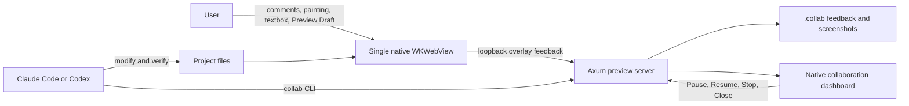

# html-agent-collab

[繁體中文](README.zh-TW.md)

Collaborate with Claude Code or Codex on a single HTML page through one native macOS preview. Leave feedback as comments, paintings, textbox notes, or a Preview Draft directly in the page; the agent picks it up through the `collab` CLI and continuously resolves each item.

Built with Rust, Tauri 2, and one WKWebView. Requires macOS 15+. No Chromium, no MCP runtime. source-only distribution — no signed or notarized binaries.

## Quick start

```bash
cargo build --release
cargo install --path . --locked
```

Open a preview and start continuous collaboration:

```text
$preview-collaboration-start path/to/page.html foreground
$preview-collaboration-start path/to/page.html background
```

The agent loop runs: `wait → acknowledged → inspect → working → modify → verify → resolved/failed → wait`.

### Workflow skills

| Skill | Purpose |
| --- | --- |
| `$preview-collaboration-start <path> foreground` | Open preview for manual inspection, no feedback loop |
| `$preview-collaboration-start <path> background` | Open preview and continuously process feedback |
| `$preview-collaboration-connect <preview-id>` | Attach to an existing preview from a different conversation |
| `$preview-collaboration-stop` | Detach the agent but keep the preview open |
| `$preview-collaboration-close` | Close the preview runtime entirely |

## CLI reference

The skills above compose these atomic commands. All output is JSON.

| Command | Purpose |
| --- | --- |
| `collab open <entry> [--background]` | Open or reuse a preview |
| `collab attach --project <project> --agent <kind>` | Create an active attachment |
| `collab status --project <project>` | Read session, entry, and attachment state |
| `collab pause --project <project> [--attachment <id>]` | Pause now or after current feedback |
| `collab resume --project <project> [--attachment <id>]` | Resume a paused attachment |
| `collab detach --project <project> [--attachment <id>]` | Stop collaboration, keep the preview |
| `collab close --project <project>` | Close the runtime and all attachments |
| `collab screenshot --project <project>` | Capture a WKWebView snapshot |
| `collab eval --project <project> <expression>` | Evaluate JavaScript in the page |
| `collab wait --project <project> --attachment <id> --json` | Wait for feedback or stop signal |
| `collab feedback show --project <project> <id>` | Read one feedback item |
| `collab feedback set-state ...` | Advance lifecycle state |

## Preview interface

The toolbar appears when an agent is attached, providing four feedback tools:

| Tool | How to use |
| --- | --- |
| Comment | Click an element on the page to attach a comment to it |
| Painting | Draw freehand, rectangles, arrows, or text labels over the page |
| Textbox | Write a free-form note about the page |
| Preview Draft | Edit the complete HTML source in a native plain-text pane, select a rendered element as the focus hint, then choose Apply to source |

The agent picks up each submission automatically and works through it.

Preview Draft expands the existing window into a left Preview and right native
editor while retaining a single WKWebView. The right Draft pane shows the
complete HTML source in a monospaced font with basic HTML syntax highlighting;
Undo, Redo, Reset, and Apply to source appear only in that pane. The initial
split is Preview 60 percent and Draft 40 percent, remains manually draggable,
and keeps the panes at least 640 and 360 points wide. Edits change only the
current rendered DOM; Apply to source creates a pending agent handoff with the
before/after complete documents and does not write project files directly.
reload or navigation discards the visual draft. The editor is HTML-only. A
rendered element is selected only as a focus hint, and its `outerHTML` must have
one exact source match before the editor selects that range. The rendered HTML
may differ from source templates, and a dynamic framework rerender can
invalidate that focus.

The native collaboration dashboard provides session controls:

| Action | Result |
| --- | --- |
| Connect agent | Reveals the Preview ID and connect command for attaching from another conversation |
| Draft | Opens or closes the Preview Draft split editor |
| Pause | Pauses feedback processing after the current item finishes |
| Resume | Reactivates a paused attachment |
| Stop collaboration | Detaches the agent but keeps the preview open |
| Close preview | Closes the preview runtime entirely |

See [Collaboration guide](docs/COLLABORATION.md) for lifecycle and marker state details.

## Architecture



## Prerequisites

| Item | Requirement |
| --- | --- |
| OS | macOS 15+ |
| Rust | 1.97.0 (pinned by `rust-toolchain.toml`) |
| Tools | Xcode Command Line Tools, [rustup](https://rustup.rs/) |
| Acceptance tests | `jq`, `curl` |

## Security

See [SECURITY.md](SECURITY.md). Report vulnerabilities through GitHub private vulnerability reporting. Add `.collab/` to `.gitignore` — it contains the control token and runtime artifacts.

## Verification

```bash
cargo fmt -- --check
cargo test
cargo clippy --all-targets --all-features -- -D warnings
cargo package
scripts/session-ux-acceptance.sh
```

## Documentation

- [Collaboration guide](docs/COLLABORATION.md) — start modes, lifecycle, feedback types, marker states
- [Development and pull request workflow](CONTRIBUTING.md)
- [Changelog](CHANGELOG.md)
- [Release procedure](docs/RELEASING.md)
- [Security model and vulnerability reporting](SECURITY.md)
- [Code of Conduct](CODE_OF_CONDUCT.md)

## License

MIT OR Apache-2.0. See `LICENSE-MIT` or `LICENSE-APACHE`.
