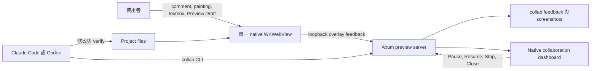

# html-agent-collab

[English](README.md)

透過 macOS native preview，與 Claude Code 或 Codex 協作單一 HTML 頁面。在頁面上直接留下 comment、painting、textbox 或 Preview Draft feedback，agent 透過 `collab` CLI 接收並持續處理每筆 feedback。

使用 Rust、Tauri 2 與單一 WKWebView 建置。需要 macOS 15 以上。不啟動 Chromium，不需要 MCP runtime。僅提供 source-only distribution，無簽署或 notarize 的 binary。

## 快速開始

安裝 `collab` binary：

```bash
cargo build --release
cargo install --path . --locked
```

以 plugin 安裝 workflow skills。Claude Code：

```text
/plugin marketplace add YiChin-17/html-agent-collab
/plugin install collab@html-agent-collab
```

Codex：

```bash
codex plugin marketplace add YiChin-17/html-agent-collab
codex plugin add collab@html-agent-collab
```

Claude Code 會為 plugin skills 加上 namespace，因此下方的 `$preview-collaboration-start` 在安裝 plugin 後以 `/collab:preview-collaboration-start` 呼叫。Clone 本 repository 的貢獻者不必安裝 plugin 即可取得相同 skills。

開啟 preview 並啟動持續協作：

```text
$preview-collaboration-start path/to/page.html foreground
$preview-collaboration-start path/to/page.html background
```

Agent 迴圈：`wait → acknowledged → inspect → working → verify → resolved/failed → wait`。

### Workflow skills

| Skill | 用途 |
| --- | --- |
| `$preview-collaboration-start <path> foreground` | 開啟 preview 供手動檢視，不進入 feedback 迴圈 |
| `$preview-collaboration-start <path> background` | 開啟 preview 並持續處理 feedback |
| `$preview-collaboration-connect <preview-id>` | 從另一個 conversation attach 到既有 preview |
| `$preview-collaboration-stop` | Detach agent，保留 preview |
| `$preview-collaboration-close` | 關閉整個 preview runtime |

## CLI reference

上方 skills 由以下 atomic commands 組成，所有輸出皆為 JSON。

| Command | 用途 |
| --- | --- |
| `collab open <entry> [--background]` | 開啟或 reuse preview |
| `collab attach --project <project> --agent <kind>` | 建立 active attachment |
| `collab status --project <project>` | 讀取 session、entry 與 attachment 狀態 |
| `collab pause --project <project> [--attachment <id>]` | 立即暫停或等目前 feedback 完成後暫停 |
| `collab resume --project <project> [--attachment <id>]` | 恢復 paused attachment |
| `collab detach --project <project> [--attachment <id>]` | 停止協作，保留 preview |
| `collab close --project <project>` | 關閉 runtime 與全部 attachments |
| `collab screenshot --project <project>` | 擷取 WKWebView snapshot |
| `collab eval --project <project> <expression>` | 在頁面中執行 JavaScript |
| `collab wait --project <project> --attachment <id> --json` | 等待 feedback 或 stop 訊號 |
| `collab feedback show --project <project> <id>` | 讀取單筆 feedback |
| `collab feedback set-state ...` | 推進 lifecycle 狀態 |

## Preview 介面

Agent attach 後工具列會顯示，提供四種 feedback 工具：

| 工具 | 操作方式 |
| --- | --- |
| Comment | 點選頁面上的元素，對該元素留下 comment |
| Painting | 在頁面上畫 freehand、矩形、箭頭或文字標記 |
| Textbox | 寫一段關於頁面的自由文字 |
| Preview Draft | 在 native plain-text 面板編輯 complete HTML source，選取 rendered element 作為 focus hint，再按 Apply to source |

Agent 會自動接收每筆 feedback 並處理。

Preview Draft 會把現有視窗分成左側 Preview 與右側 native editor，
全程仍只有 single WKWebView。right Draft pane（右側面板）以 monospaced font 顯示
complete HTML source，並提供基礎 HTML syntax highlighting；Undo, Redo, Reset, and Apply to source
只出現在該 pane。初始分割為 Preview 60% 與 Draft 40%，可手動拖曳，
兩側最小寬度分別為 640 與 360 points。編輯只改目前 rendered DOM；
Apply to source 會建立含修改前後 complete documents 的 pending agent
handoff，不會直接寫入專案檔案。reload 或 navigation
會捨棄畫面上的 draft。編輯器僅支援 HTML-only。Rendered element 只作為
focus hint，`outerHTML` 必須在 source 中只有一個 exact match，editor
才會選取該範圍。rendered HTML 可能與 source template 不同，dynamic
framework rerender 也可能讓該 focus 失效。

Native collaboration dashboard 提供以下控制：

| 動作 | 結果 |
| --- | --- |
| Connect agent | 顯示 Preview ID 與 connect 指令，供另一個 conversation attach |
| Draft | 開啟或關閉 Preview Draft 左右分割編輯器 |
| Pause | 等目前 feedback 處理完後暫停 |
| Resume | 恢復已暫停的 attachment |
| Stop collaboration | Detach agent，保留 preview |
| Close preview | 關閉整個 preview runtime |

Lifecycle 與 marker 狀態細節詳見 [Collaboration guide](docs/COLLABORATION.md)。

## 架構圖



## 先決條件

| 項目 | 需求 |
| --- | --- |
| 作業系統 | macOS 15 以上 |
| Rust | 1.97.0（由 `rust-toolchain.toml` 固定） |
| 工具 | Xcode Command Line Tools、[rustup](https://rustup.rs/) |
| Acceptance tests | `jq`、`curl` |

## 安全性

詳見 [SECURITY.md](SECURITY.md)。透過 GitHub private vulnerability reporting 通報漏洞。請將 `.collab/` 加入 `.gitignore`，其中包含 control token 與 runtime artifacts。

## 驗證

```bash
cargo fmt -- --check
cargo test
cargo clippy --all-targets --all-features -- -D warnings
cargo package
scripts/session-ux-acceptance.sh
```

## 文件索引

- [Collaboration guide](docs/COLLABORATION.md) — start modes、lifecycle、feedback 類型、marker 狀態
- [開發與 pull request 流程](CONTRIBUTING.md)
- [變更紀錄](CHANGELOG.md)
- [Release 流程](docs/RELEASING.md)
- [安全模型與漏洞通報](SECURITY.md)
- [行為準則](CODE_OF_CONDUCT.md)

## 授權

MIT OR Apache-2.0，詳見 `LICENSE-MIT` 或 `LICENSE-APACHE`。
